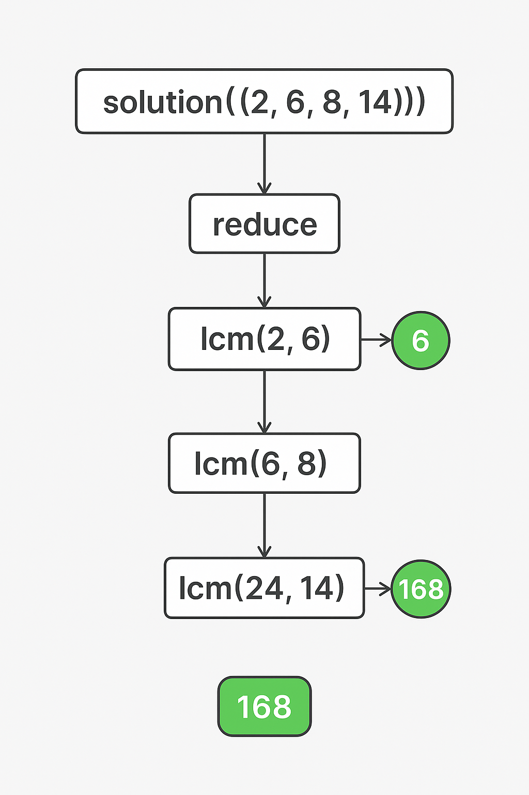

### **문제 설명**

두 수의 최소공배수(Least Common Multiple)란 입력된 두 수의 배수 중 공통이 되는 가장 작은 숫자를 의미합니다. 예를 들어 2와 7의 최소공배수는 14가 됩니다. 정의를 확장해서, n개의 수의 최소공배수는 n 개의 수들의 배수 중 공통이 되는 가장 작은 숫자가 됩니다. n개의 숫자를 담은 배열 arr이 입력되었을 때 이 수들의 최소공배수를 반환하는 함수, solution을 완성해 주세요.

### 제한 사항

- arr은 길이 1이상, 15이하인 배열입니다.
- arr의 원소는 100 이하인 자연수입니다.

### 입출력 예

| arr        | result |
| ---------- | ------ |
| [2,6,8,14] | 168    |
| [1,2,3]    | 6      |

<hr/>

```js
// 최대 공약수
// 두 수 a, b의 최대공약수는 b가 0이 될 때까지 a % b를 반복해서 구해나가는 방식
const gcd = (a, b) => {
  return b === 0 ? a : gcd(b, a % b)
}

// 최소 공배수 = 숫자 곱/최대공약수
const lcm = (a, b) => {
  return (a * b) / gcd(a, b)
}

function solution(arr) {
  return arr.reduce((acc, cur) => lcm(acc, cur))
}
```

- 최대공약수(GCD): 두 수가 동시에 나눠지는 가장 큰 수
- 최소공배수(LCM): 두 수가 동시에 나눠지는 가장 작은 배수
- 👉 LCM = (a × b) / GCD

| 함수 이름       | 목적              | 설명                                                                                             | 예시                            |
| --------------- | ----------------- | ------------------------------------------------------------------------------------------------ | ------------------------------- |
| `gcd(a, b)`     | 최대공약수        | 두 수 `a`, `b`의 최대공약수를 재귀적으로 계산함. `b`가 0이 될 때까지 `gcd(b, a % b)`를 반복 호출 | `gcd(24, 14)` → 2               |
| `lcm(a, b)`     | 최소공배수        | 두 수 `a`, `b`의 최소공배수를 계산함. `a * b / gcd(a, b)` 공식 사용                              | `lcm(6, 8)` → 24                |
| `solution(arr)` | 배열의 최소공배수 | 배열 안의 모든 수에 대해 최소공배수를 차례로 구함. `reduce`를 사용해서 두 수씩 `lcm`을 누적      | `solution([2, 6, 8, 14])` → 168 |

### reduce

배열을 왼쪽에서 오른쪽으로 차례대로, 두 개씩 꺼내서 lcm을 계속 적용함.

```js
arr.reduce((acc, cur) => lcm(acc, cur))
```

- 처음엔 acc = arr[0], cur = arr[1]
- 그리고 lcm(acc, cur)을 구한 값을 다음 acc로 사용
- 계속해서 배열의 끝까지 반복함


