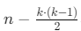

### **문제 설명**

Finn은 요즘 수학공부에 빠져 있습니다. 수학 공부를 하던 Finn은 자연수 n을 연속한 자연수들로 표현 하는 방법이 여러개라는 사실을 알게 되었습니다. 예를들어 15는 다음과 같이 4가지로 표현 할 수 있습니다.

- 1 + 2 + 3 + 4 + 5 = 15
- 4 + 5 + 6 = 15
- 7 + 8 = 15
- 15 = 15

자연수 n이 매개변수로 주어질 때, 연속된 자연수들로 n을 표현하는 방법의 수를 return하는 solution를 완성해주세요.

### 제한사항

- n은 10,000 이하의 자연수 입니다.

---

### 입출력 예

| n   | result |
| --- | ------ |
| 15  | 4      |

<hr>

### 접근 방법 💣💣💣

연속된 자연수 k개의 합을 나타내는 경우 <br>
`a+(a+1)+(a+2)+⋯+(a+(k−1))=n`
<br>

- a는 연속의 시작 숫자
- k는 연속된 숫자의 개수

정리하면<br>
<br>


a가 자연수여야 하므로,
가 k로 나누어 떨어져야 한다.

```js
function solution(n) {
  let count = 0 // 연속된 자연수들로 n을 표현하는 방법의 수
  let k = 1 // 연속된 자연수의 개수

  while ((k * (k - 1)) / 2 < n) {
    if ((n - (k * (k - 1)) / 2) % k === 0) {
      count++
    }
    k++
  }
  return count
}
```
