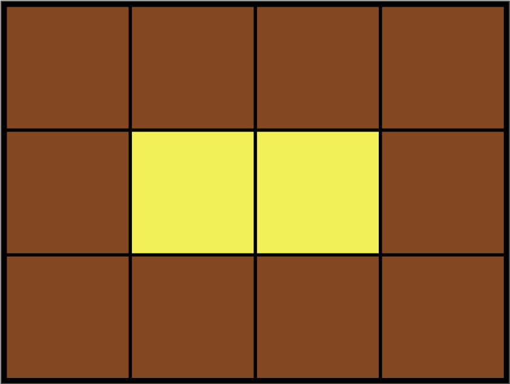

Leo는 카펫을 사러 갔다가 아래 그림과 같이 중앙에는 노란색으로 칠해져 있고 테두리 1줄은 갈색으로 칠해져 있는 격자 모양 카펫을 봤습니다.



Leo는 집으로 돌아와서 아까 본 카펫의 노란색과 갈색으로 색칠된 격자의 개수는 기억했지만, 전체 카펫의 크기는 기억하지 못했습니다.

Leo가 본 카펫에서 갈색 격자의 수 brown, 노란색 격자의 수 yellow가 매개변수로 주어질 때 카펫의 가로, 세로 크기를 순서대로 배열에 담아 return 하도록 solution 함수를 작성해주세요.

### 제한사항

- 갈색 격자의 수 brown은 8 이상 5,000 이하인 자연수입니다.
- 노란색 격자의 수 yellow는 1 이상 2,000,000 이하인 자연수입니다.
- 카펫의 가로 길이는 세로 길이와 같거나, 세로 길이보다 깁니다.

### 입출력 예

| brown | yellow | return |
| ----- | ------ | ------ |
| 10    | 2      | [4, 3] |
| 8     | 1      | [3, 3] |
| 24    | 24     | [8, 6] |

<hr>

### 접근 방법

- 테두리는 무조건 갈색(너비와 높이 각각 1칸씩 차지할 것임)
- 노란색의 너비는 전체너비-2
- 노란색의 높이는 전체높이-2
- `yellow = (width - 2) * (height - 2)`

입출력 예를 봤을 때 전체 개수=brown+yellow
`width * height = 전체개수`
`width * height = brown + yellow`

```js
function solution(brown, yellow) {
  let total = brown + yellow

  // 최소 높이 3
  for (let height = 3; height < total; height++) {
    // total이 height로 나누어 떨어지면, width를 구할 수 있다.
    if (total % height === 0) {
      let width = total / height

      // 노란색 격자 수와 일치하는지 확인
      if ((width - 2) * (height - 2) === yellow) {
        return [width, height]
      }
    }
  }
}
```
